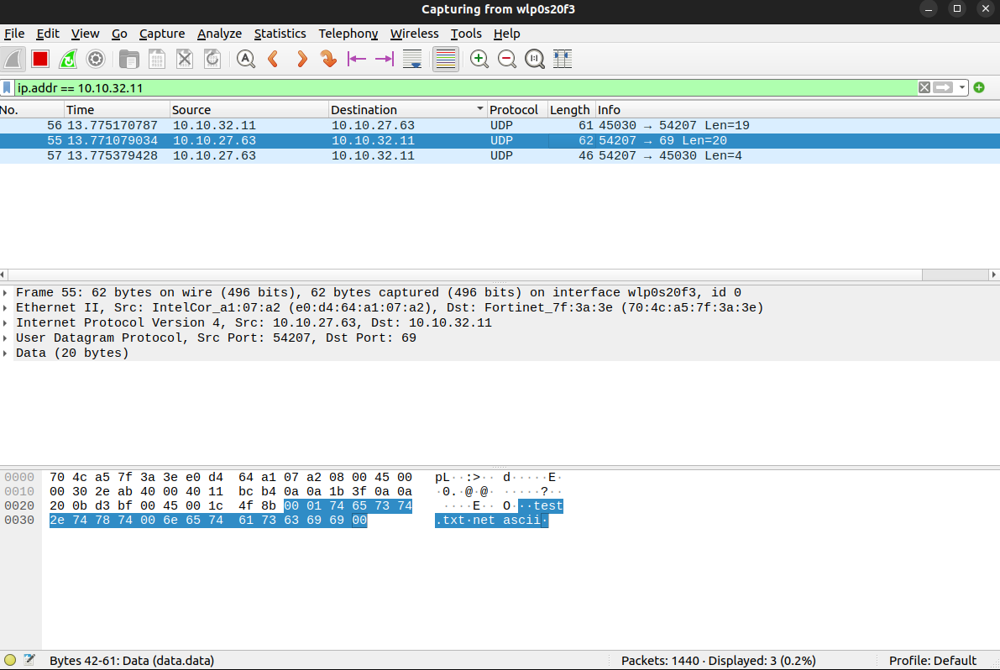
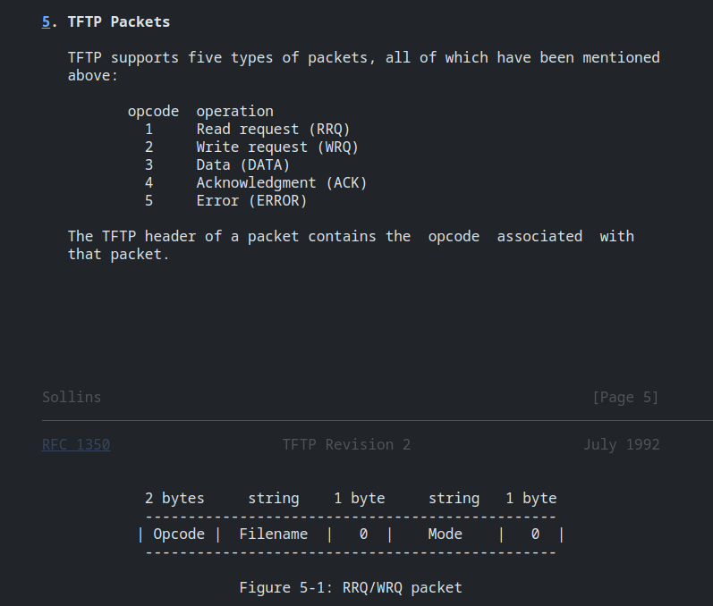
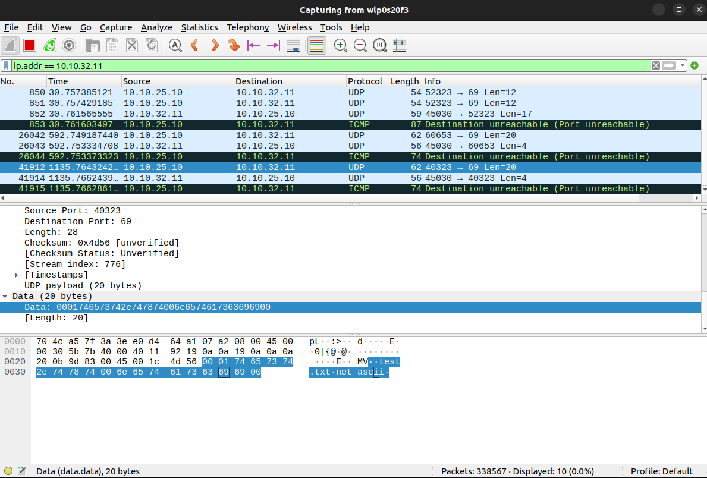

# LAB - TFTP Client

## Objective

The main objective of this practical work is to create a client program capable of exchanging files using the Trivial File Transfer
Protocol (TFTP).

### Step 0 - Server Testing

We test the server connection by entering the following command in a terminal: 

```shell
tftp srvtpinfo1.ensea.fr
``` 

Afterwards, we can verify if the connection was successful by retrieving a test file stored on the server.
```
tftp> get test.txt
```



We got the sequence:
```
00 01 74 65 73 74 6e 74 78 74 00 6e 65 74 61 73 63 69 69 00"
```


According to the documentation, our structure provides the following informations:

* Opcode: 00 01 (Read request - RRQ)
* Filename: 74 65 73 74 6e 74 78 74 00 (ASCII representation of "test.txt" followed by a null terminator)
* 0: Null byte as a separator
* Mode: 6e 65 74 61 73 63 69 69 00 (ASCII representation of "netascii" followed by a null terminator)

### Step 1 - Using command-line arguments for the gettftp and puttftp programs to obtain request information (server and file).

We begin by checking that the entered command lines are in the correct format : 

* We verify that the number of arguments is the expected value.
* We check if the file exists.
* We confirm that the file is a regular file.

### Step 2 - Calling getaddrinfo to obtain the server’s address.

We use a 'hints' structure to obtain the server's address. 
```c
    memset(&hints,0,sizeof(hints));
    hints.ai_protocol=IPPROTO_UDP;
    hints.ai_socktype = SOCK_DGRAM;
    hints.ai_family=AF_INET;
```
We set the parameters of the structure to search for the address of our server, with UDP type for the IPv4 family. The port used is also specified inside of a macro.
```c
status = getnameinfo(result->ai_addr, result->ai_addrlen, ipAdress, MAX_CHAR_SIZE, bufferServerName, MAX_CHAR_SIZE, NI_NUMERICHOST | NI_NUMERICSERV);
```
We then store the result of 'getaddrinfo' in an addrinfo structure (result), and if the status is not an error, we display the retrieved IP address.
```shell
$ ./tftp_Q4 get srvtpinfo1.ensea.fr test.txt
Communication with : 10.10.32.11:69
```

### Step 3 - Reserve a connection socket to the server.

For establishing a connection to the server, we create a socket using information from our previous structure. 
```c
socketDescriptor = socket(res->ai_family, res->ai_socktype, res->ai_protocol);
```
We check for errors during socket creation and connection establishment.

We will then can then use our 'socketDescriptor' to send and receive requests from the server."

### Step 4 - Gettftp management

The 'gettftp' function is responsible for handling the process of retrieving a file from the TFTP server. 

We generate a TFTP Read Request (RRQ) packet, which includes the opcode (00 01), the filename in ASCII representation, a null byte separator (00), and the transfer mode (netascii followed by a null terminator) :
```c
char data[2 + strlen(filename) + strlen(filename) + 2];
data[0] = 0x00; 
data[1] = 0x01;
strcpy(data + 2, filename);
strcpy(data + 2 + strlen(filename) + 1, "netascii");
```
The RRQ packet is sent to the server by with a 'write' function using the socketDesciptor'. The function 'chooseCommand' allows us to manage whether we send a gettftp or puttftp request.

We can directly confirm that the packet has been successfully sent as expected by checking on Wireshark. For example with:
```shell
$ ./tftp_Q4 get srvtpinfo1.ensea.fr test.txt
```
we got the following sequence:

